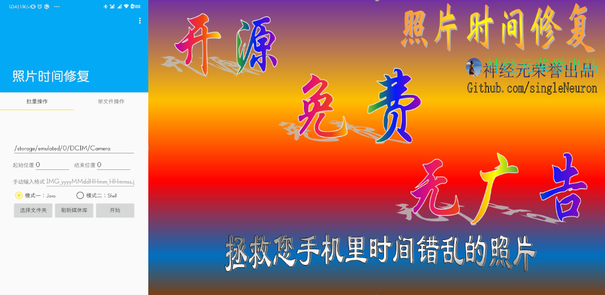

# 照片时间修复

一个简单的小程序以通过文件名修复手机中照片/屏幕截图的时间错误

本程序在酷安发布:[https://www.coolapk.com/apk/tech.lincaiqi.PhotoTimeFix](https://www.coolapk.com/apk/tech.lincaiqi.PhotoTimeFix)，ID @神经元

### [隐私权政策](./PrivacyPolicy)