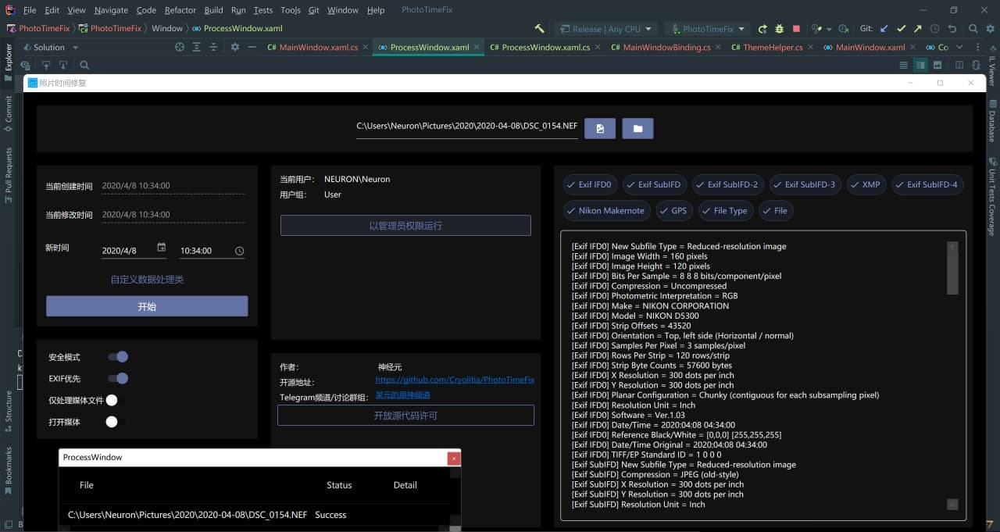
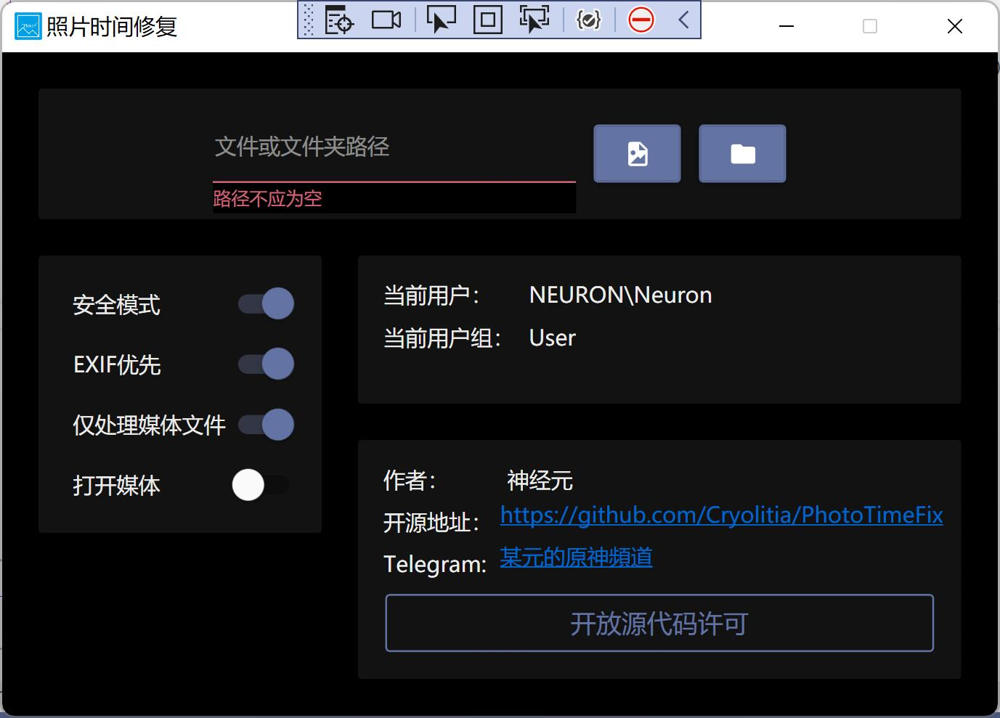
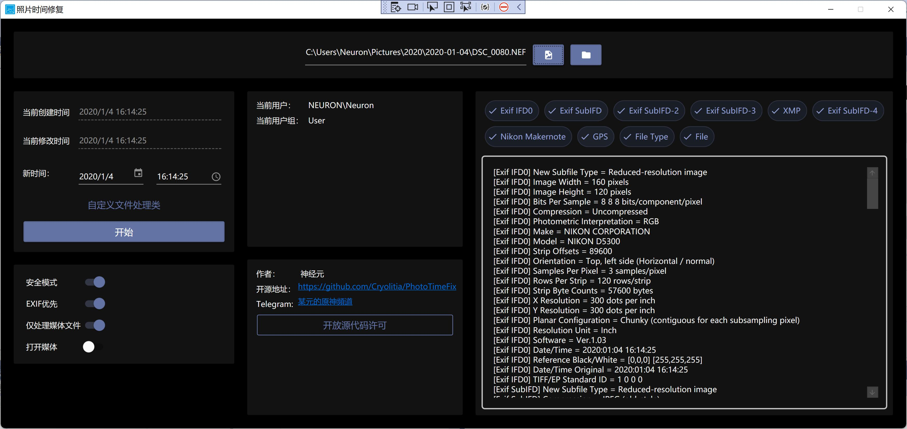

# PhotoTimeFix (WPF)

<a href="https://www.microsoft.com/store/apps/9NFL0WD4NJXP"></img></a>

一个简单的小程序以通过文件名(或Exif)修复照片/屏幕截图的时间错误

An easy program aimed to fix photo's timestamp incorrect by filename/Exif

您是否曾经在备份照片后面对整齐划一的时间戳变成了今天的成千上万张照片不知所措？快来试试吧，这个软件可以通过文件名和文件中的Exif数据来恢复文件的时间戳，还支持自定义精确时间和批处理。永久开源免费！

* 现代的Material Design界面设计，自动适应系统主题（仅支持Windows 10 1903+）
* 自动尝试解析文件名和Exif信息
* 丰富的Exif元数据查看
* 完整的C#脚本支持，图灵完备的语言让您可以以任何自己想要的方式处理照片
* 内置NSudo，允许您两键即可最高以 `Trust Installer` 权限运行
* 完全永久的开源免费

